# PS5 SMART COOLER

PS5 Smart Cooler - аппаратная модификация, расширяющая возможности штатной системы охлаждения PlayStation 5. Она позволяет следить за температурой и работой вентилятора, гибко настраивать охлаждение и параметры питания APU через веб-интерфейс. Устройство работает напрямую с аппаратными сигналами консоли, не внося изменений в её операционную систему или прошивку.

**Автор:** Walkman Life TV  
**Соавтор:** Tony (Repair-Fix)  
**Редактор:** FreeGen

**Актуализировано: 13.09.2026**

<a id="top"></a>

## Содержание

- [1. Важные предупреждения](#safety)
  - [1.1 Работа внутри консоли](#installation-safety)
  - [1.2 Прошивка ESP32-C3](#firmware-safety)
  - [1.3 Управление вентилятором](#fan-safety)
  - [1.4 Настройка напряжений](#voltage-safety)
- [2. Установка и обновление прошивки](#firmware)
  - [2.1 Что понадобится](#firmware-requirements)
  - [2.2 Выбор установщика](#installer-selection)
  - [2.3 Первая установка](#first-install)
  - [2.4 Обновление прошивки](#firmware-update)
- [3. Установка устройства в PS5](#installation)
  - [3.1 Варианты установки](#installation-options)
  - [3.2 Распиновка ESP32-C3](#pinout)
  - [3.3 Дополнительная плата](#additional-board)
  - [3.4 Подключение к PS5](#ps5-connection)
  - [3.5 Проверка перед включением](#pre-power-check)
  - [3.6 Размещение устройства и проводов](#device-placement)
  - [3.7 Проблемы встроенной антенны](#antenna)
- [4. Подключение к Wi-Fi](#wifi)
  - [4.1 Режим точки доступа](#wifi-ap)
  - [4.2 Подключение к домашнему роутеру](#wifi-router)
  - [4.3 Восстановление связи с роутером](#wifi-recovery)
- [5. Главный экран и основные функции](#main-screen)
  - [5.1 Кольцо температуры](#temperature-ring)
  - [5.2 Статистика и график](#statistics)
  - [5.3 Системные элементы](#system-controls)
  - [5.4 Интерфейс V2](#interface-v2)
- [6. Режимы управления вентилятором](#fan-modes)
  - [6.1 MANUAL](#manual-mode)
  - [6.2 OFFSET](#offset-mode)
  - [6.3 TARGET](#target-mode)
  - [6.4 GRAPH](#graph-mode)
- [7. Расширенный мониторинг и диагностика](#monitoring)
  - [7.1 Advanced Settings](#advanced-settings)
  - [7.2 Расширенный мониторинг](#advanced-monitoring)
  - [7.3 Диагностика уровня PWM](#pwm-diagnostics)
- [8. Настройка напряжений](#voltage-control)
  - [8.1 Доступ к Voltage Control](#voltage-access)
  - [8.2 Регистры напряжения](#voltage-registers)
  - [8.3 Подбор значений](#voltage-tuning)
  - [8.4 Проверка стабильности](#voltage-testing)
  - [8.5 Особенность PS5 Slim](#slim-voltage)
  - [8.6 Сохранение и Auto-load](#voltage-autoload)
  - [8.7 Восстановление после неудачных настроек](#voltage-recovery)
  - [8.8 PMBus Direct Access](#pmbus-direct)
- [9. RGB-подсветка](#rgb)
  - [9.1 Подключение](#rgb-connection)
  - [9.2 Основные настройки](#rgb-settings)
  - [9.3 Режимы RGB](#rgb-modes)
  - [9.4 Карта температуры и цвета](#rgb-map)
- [10. Перезагрузка и сброс](#reset)
- [11. Устранение проблем](#troubleshooting)
- [12. Часто задаваемые вопросы](#faq)
- [13. Поддержка и полезные ссылки](#support)

<a id="safety"></a>

---

## 1. Важные предупреждения

<a id="installation-safety"></a>

### 1.1 Работа внутри консоли

Установка PS5 Smart Cooler требует вмешательства во внутреннее устройство PlayStation 5. Такие работы должен выполнять человек с опытом пайки и ремонта электроники.

Ошибки при монтаже могут привести к короткому замыканию, повреждению консоли или её компонентов, потере данных, возгоранию и потере гарантии. Автор программного и аппаратного обеспечения не несёт ответственности за ущерб, возникший из-за неправильной установки, настройки или эксплуатации.

Соблюдайте основные правила:

- перед пайкой и изменением соединений полностью обесточьте консоль;
- не подключайте и не отключайте вентилятор на запитанной консоли;
- проверьте ориентацию плат и отсутствие замыканий до подачи питания;
- если вы не уверены в своих навыках, передайте установку квалифицированному специалисту.

<a id="firmware-safety"></a>

### 1.2 Прошивка ESP32-C3

При первой установке бесплатной или полной версии на **ESP32-C3** необратимо активируются аппаратное шифрование flash-памяти и защита eFuse. Эти изменения относятся только к ESP32-C3 и не затрагивают программное обеспечение PS5.

После активации защиты:

- плату нельзя вернуть в исходное состояние;
- обычная прошивка через Arduino IDE или `esptool` становится недоступна;
- обновления устанавливаются только официальным установщиком PS5 Smart Cooler;
- обновление по воздуху (OTA) невозможно;
- отключаются аппаратный и USB JTAG.

Сбой питания во время первой записи eFuse может сделать ESP32-C3 неработоспособной. Используйте исправный USB-кабель, обеспечьте стабильное питание и не трогайте соединения до завершения процесса.

<a id="fan-safety"></a>

### 1.3 Управление вентилятором

Полная версия напрямую управляет вентилятором PS5. Перед использованием ознакомьтесь с [назначением дополнительной платы](#additional-board) и [ограничениями режима MANUAL](#manual-mode).

<a id="voltage-safety"></a>

### 1.4 Настройка напряжений

Настройка напряжений предназначена для опытных пользователей и связана с риском нестабильной работы или повреждения консоли. Перед изменением параметров прочитайте раздел [Настройка напряжений](#voltage-control).

<a id="firmware"></a>

---

## 2. Установка и обновление прошивки

<a id="firmware-requirements"></a>

### 2.1 Что понадобится

- компьютер с Windows;
- свободный USB-порт;
- плата ESP32-C3 SuperMini с 4 МБ flash-памяти;
- исправный USB-кабель с передачей данных;
- драйвер USB-преобразователя;
- доступ в интернет;
- установщик выбранной версии.

Перед запуском отключите другие устройства, создающие виртуальные COM-порты. Убедитесь, что после подключения ESP32-C3 в диспетчере устройств Windows появляется новый COM-порт. Если потребуется, разрешите доступ установщика к интернету в настройках брандмауэра.

<a id="installer-selection"></a>

### 2.2 Выбор установщика

- **Бесплатная версия:** [`PS5_Smart_Cooler_Installer_Monitoring.exe`](ССЫЛКА_НА_УСТАНОВЩИК_MONITORING)
- **Полная версия:** [`PS5_Smart_Cooler_Installer_Full.exe`](ССЫЛКА_НА_УСТАНОВЩИК_FULL)

Для полной версии установщик проверяет Device ID в базе лицензий. Если появляется сообщение `ID НЕТ В БАЗЕ`, передайте Device ID разработчику, дождитесь его добавления и перезапустите установщик.

<a id="first-install"></a>

### 2.3 Первая установка

> **Важно:** при первой установке необратимо активируются защита eFuse и шифрование flash-памяти. После этого плата обновляется только официальным установщиком. Обеспечьте стабильное питание и не отключайте USB до завершения установки.

1. Подключите ESP32-C3 к компьютеру по USB. Обычно удерживать кнопку **BOOT** не требуется. Используйте её только если установщик не обнаруживает плату или явно просит включить режим загрузки.
2. Запустите установщик выбранной версии. При необходимости используйте запуск от имени администратора.
3. Дождитесь обнаружения COM-порта и появления Device ID.
4. В полной версии дождитесь результата проверки лицензии.
5. Дождитесь загрузки прошивки и проверки её целостности.
6. После предупреждения о необратимых изменениях введите латинскую `y` и нажмите Enter.
7. Не отключайте USB и не закрывайте программу во время записи прошивки и настройки eFuse.
8. Дождитесь успешной активации и запуска монитора порта.

Основные этапы установщика выглядят так:

```text
[*] Проверка сервера...                    ✅ [Сервер найден]
[*] Поиск устройства на COM-порту...       ✅ [ID: XXXXXXXXXXXX]
[*] Шаг 1: Проверка лицензии...            ✅ ДОСТУП РАЗРЕШЕН
[*] Шаг 2: Загрузка прошивки...            ✅ ГОТОВО
[*] Шаг 3: Проверка целостности...         ✅ ОК
[*] Шаг 4: Запись данных и защита...       ✅ ЗАВЕРШЕНО
[*] Шаг 5: Активация устройства...         ✅ Устройство успешно активировано
```

После запуска устройство выводит в монитор порта Device PIN, Device ID, режим Wi-Fi и адрес интерфейса. Для выхода из монитора нажмите **Ctrl+C**.

```text
--- BOOTING ---
Initializing Hardware...
Device PIN: 1234
Device ID: ID:012AB3451234
✅ ALREADY ACTIVATED
📖 Settings loaded successfully!
📡 WiFi SSID: PS5_Smart_Cooler, Mode: 0
--- AP Mode Started ---
Access Point Name: PS5_Smart_Cooler
IP: 192.168.4.1
System Ready (Hardware Sync)
```

При первой установке активация иногда не завершается, потому что плата всё ещё находится в режиме BOOT. В этом случае:

1. Закройте монитор порта.
2. Отключите ESP32-C3 от USB.
3. Подключите её снова **без удерживания BOOT**.
4. Повторно запустите установщик.

Если ESP32-C3 не определяется ещё до появления Device ID, при обращении в поддержку укажите версию Windows и название устройства, которое появляется в диспетчере устройств.

<a id="firmware-update"></a>

### 2.4 Обновление прошивки

Обновление выполняется тем же установщиком, который соответствует вашей версии прошивки.

1. Выключите PS5 и отключите консоль от розетки.
2. Для наиболее безопасного обновления отсоедините разъём между ESP32-C3 и остальной схемой. Это исключит подачу питания с USB на цепи консоли.
3. Подключите ESP32-C3 к компьютеру по USB без удерживания BOOT.
4. Запустите установщик соответствующей версии.
5. Не отключайте USB до появления сообщения об успешном завершении.
6. После обновления отключите USB и восстановите соединение устройства с консолью.
7. Заново настройте Wi-Fi, режим управления, кривую, RGB и сохранённые напряжения.

> **Примечание:** при каждом обновлении память пользовательских настроек полностью перезаписывается.

<a id="installation"></a>

---

## 3. Установка устройства в PS5

Устройство поддерживает все актуальные модели и ревизии PS5: Fat, Slim и Pro. Общая схема подключения одинакова; различается расположение контактных площадок SDA и SCL, показанное на фотографиях.

<a id="installation-options"></a>

### 3.1 Варианты установки

В таблице ниже перечислены возможности полной версии прошивки при двух вариантах монтажа.

| Возможность | Неполная установка | Полная установка |
|---|---|---|
| Разборка консоли | Не требуется | Требуется снять верхнюю охлаждающую пластину |
| Гарантийные пломбы | Не повреждаются | Повреждаются |
| Питание ESP32-C3 | От USB-порта консоли | От внутренней линии 5 В |
| MANUAL и OFFSET | Доступны | Доступны |
| TARGET и GRAPH | Недоступны без температуры | Доступны |
| Температура и расширенный мониторинг | Недоступны | Доступны |
| Настройка напряжений | Недоступна | Доступна |

При неполной установке устройство подключается к цепи управления вентилятором и получает питание от USB-порта консоли. Такой вариант не требует вскрытия корпуса и позволяет использовать только MANUAL и OFFSET.

При полной установке подключаются SDA, SCL, питание и цепи вентилятора. На всех актуальных моделях и ревизиях для установки достаточно снять верхнюю охлаждающую пластину и заменить термопрокладки с одной стороны. Жидкий металл при этом не затрагивается.

<a id="pinout"></a>

### 3.2 Распиновка ESP32-C3

Используется плата ESP32-C3 SuperMini. PWM означает широтно-импульсный сигнал управления вентилятором, а I2C - цифровую шину обмена данными с PS5.

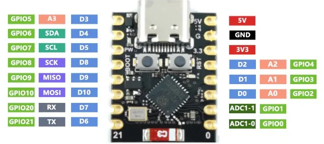

| Вывод ESP32-C3 | Подключение | Назначение |
|---|---|---|
| **GPIO0** | SCL на PS5 | Тактирование I2C |
| **GPIO1** | SDA на PS5 | Данные I2C |
| **GPIO2** | PWM OUT дополнительной платы | Необязательная диагностика уровня PWM |
| **GPIO5** | BYPASS | Управление переключением SC/PS5 |
| **GPIO6** | PWM OUT | Сигнал управления, формируемый Smart Cooler |
| **GPIO7** | PWM IN | Штатный PWM-сигнал от PS5 |
| **GPIO21** | DIN RGB | Управление адресной подсветкой |
| **5V** | 5 В после предохранителя | Питание ESP32-C3 |
| **GND** | Общая земля | Общий провод устройства и PS5 |

GPIO8 и GPIO9 для I2C в актуальной версии не используются.

<a id="additional-board"></a>

### 3.3 Дополнительная плата


Дополнительная плата физически переключает PWM-сигнал вентилятора между PS5 и Smart Cooler, защищает сигнальные линии и упрощает соединение компонентов. Если ESP32-C3 перезагрузится, зависнет или выйдет из строя, дополнительная плата автоматически возвращает управление вентилятором консоли.

> **Важно:** для безопасного управления вентилятором рекомендуется дополнительная плата. Без неё недоступны режим PS5 и аварийный возврат управления вентилятором к консоли, поэтому при отказе ESP32-C3 вентилятор может остановиться.

Обозначения на дополнительной плате:

- **5V, 3V, GND** - линии питания;
- **SDA, SCL** - шина I2C;
- **IN** - PWM-сигнал от PS5;
- **OUT** - PWM-сигнал к вентилятору;
- **BYPASS** - управление мультиплексором от GPIO5.

#### Установка ESP32-C3 на дополнительную плату

Совместите контакты двух плат по маркировке на шелкографии. Впаивайте только восемь штырей, отмеченных белыми кругами.

- GPIO5 - BYPASS;
- GPIO6 - PWM OUT;
- GPIO7 - PWM IN;
- GPIO0 - SCL;
- GPIO1 - SDA;
- 5V, 3V и GND - питание.

Остальные контакты не используются. Перед пайкой проверьте ориентацию плат.

#### Диагностические соединения

- **PWM OUT → GPIO2** - необязательное постоянное соединение для программного измерения высокого уровня PWM.
- **SJ1 - перемычка на резисторе 1 кОм в цепи PWM IN** - постоянное решение, если конкретной модели вентилятора недостаточно уровня управляющего сигнала.

> **Внимание:** устанавливайте перемычки и изменяйте соединения только на полностью обесточенной консоли.

<a id="ps5-connection"></a>

### 3.4 Подключение к PS5

1. Подключите **SDA** и **SCL** к подписанным точкам вашей ревизии PS5.
2. Подключите **5V** к дежурной линии 5 В после предохранителя.
3. Подключите **GND** к общей земле консоли.
4. Подключите дополнительную плату к цепи управления PWM между PS5 и вентилятором.
5. Подключите PWM-сигнал со стороны PS5 к контакту **IN** дополнительной платы.
6. Подключите контакт **OUT** дополнительной платы к стороне сигнала вентилятора.
7. При необходимости соедините **PWM OUT** с **GPIO2** для диагностики.
8. При использовании RGB подключите **DIN** светодиодного модуля к **GPIO21**.


*Принципиальная схема устройства*

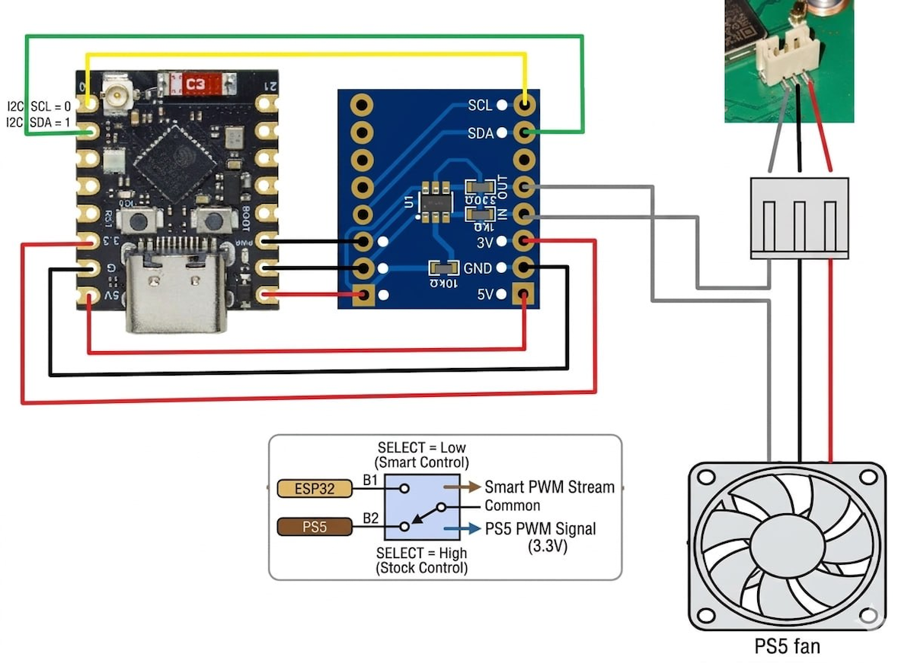

*Наглядная схема подключения*

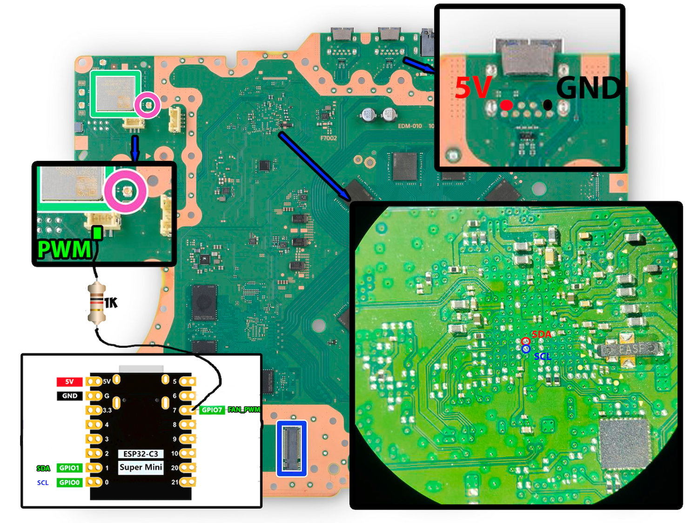

*Точки подключения Fat и Slim. Контактные площадки могут быть закрыты маской.*

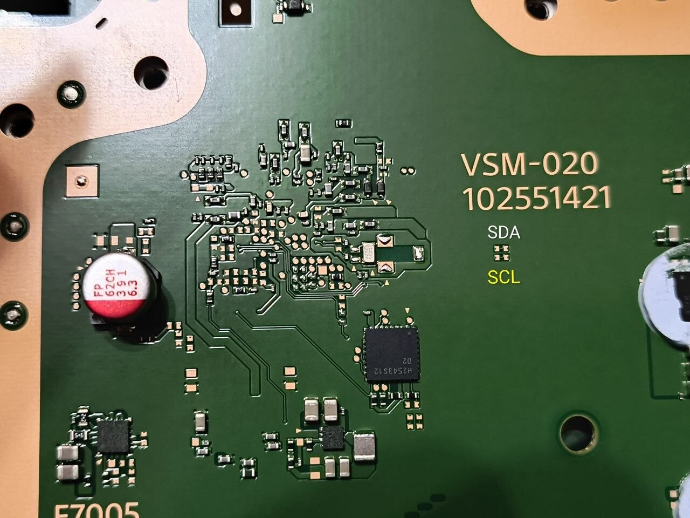

*Точки подключения PS5 Pro*

#### Пример установки на PS5 Slim первой ревизии

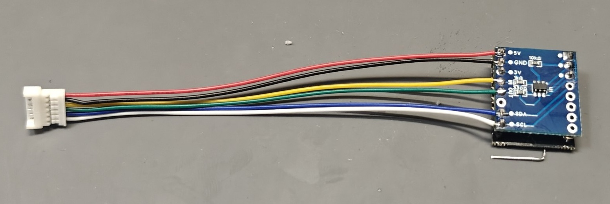

*Подключение проводов к дополнительной плате*

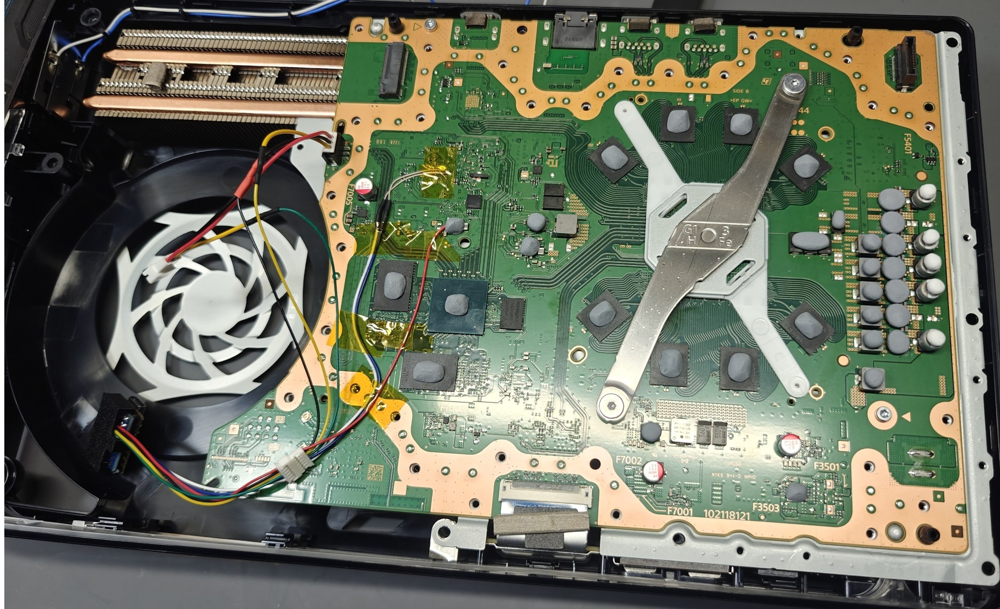

*Подключение SDA, SCL и 5 В к плате консоли*

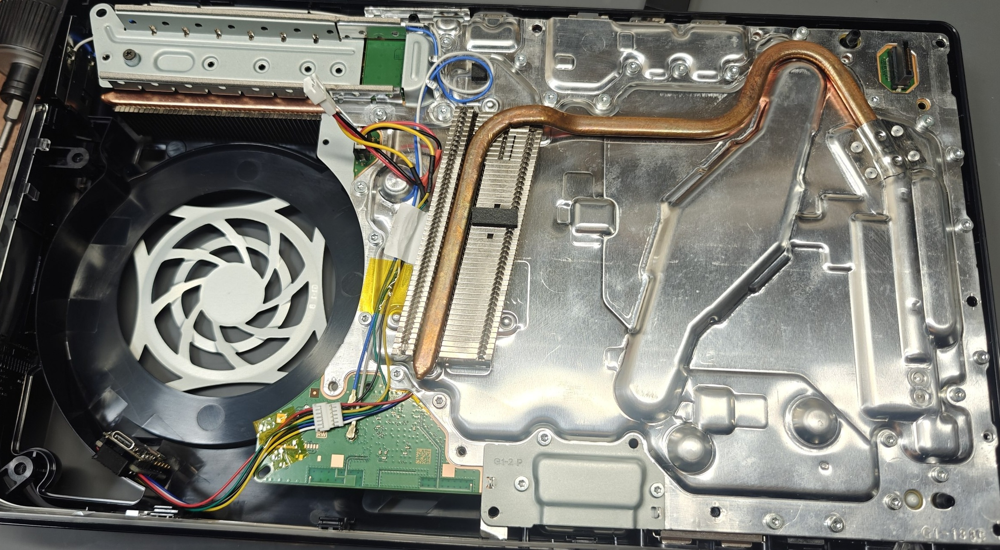

*Вывод проводов из-под охлаждающей пластины*

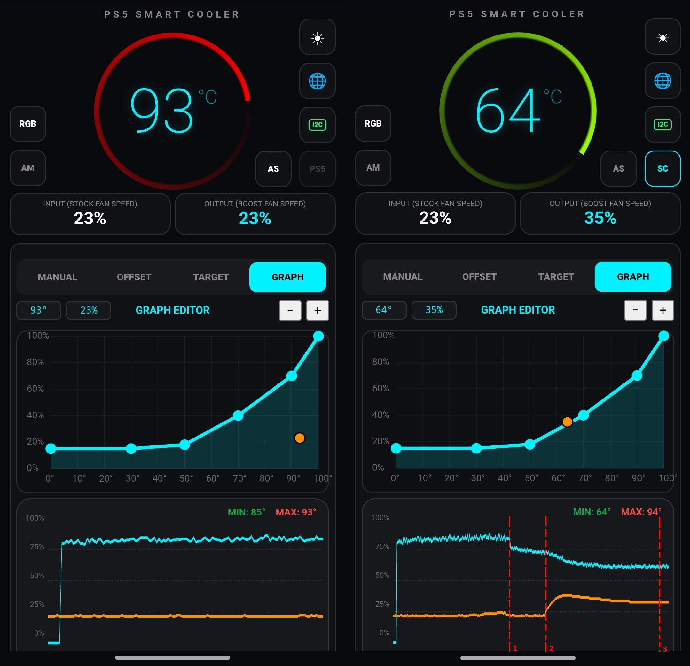

*Этапы снижения температуры: базовый андервольт, управление вентилятором по кривой, стабилизация температуры и оборотов*

<a id="pre-power-check"></a>

### 3.5 Проверка перед включением

1. Убедитесь, что ESP32-C3 установлена правильной стороной.
2. Проверьте мультиметром отсутствие короткого замыкания между 5V, 3V и GND.
3. Проверьте соединения SDA и SCL.
4. Проверьте направление цепи вентилятора: PS5 → IN, OUT → вентилятор.
5. Убедитесь, что провода закреплены и не могут попасть в лопасти.
6. Проверьте качество общей земли между ESP32-C3 и PS5.
7. Только после проверки подайте питание.

<a id="device-placement"></a>

### 3.6 Размещение устройства и проводов

Разместите ESP32-C3 в кожухе вентилятора так, чтобы она не мешала воздушному потоку и не касалась подвижных частей. При рекомендуемом размещении доступ к USB-C возможен после снятия вентилятора без полной разборки консоли.

Провода должны быть закреплены без сильного натяжения и находиться вдали от лопастей и штатных радиоантенн PS5. Не собирайте длинные сигнальные провода в тугую петлю рядом с антенной: это может ухудшить Wi-Fi ESP32-C3.

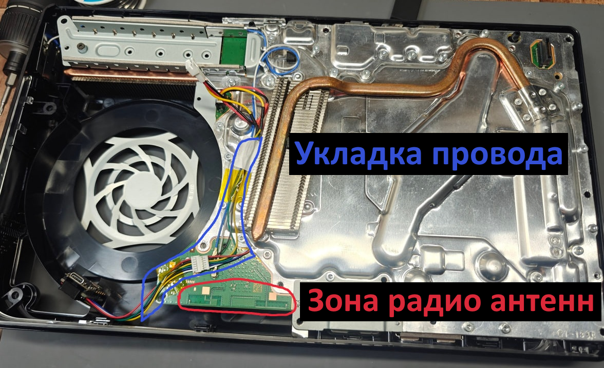

*Провода проложены вдали от штатных антенн PS5*

<a id="antenna"></a>

### 3.7 Проблемы встроенной антенны

Некоторые ESP32-C3 SuperMini имеют неудачную конструкцию встроенной антенны. Типичные признаки:

- точка доступа видна только рядом с консолью;
- после сборки связь становится нестабильной;
- ESP32-C3 подключена к роутеру, но веб-интерфейс периодически не открывается.

Сначала проверьте питание, пайку, отсутствие остатков флюса и расположение платы относительно штатных антенн PS5. Если проблема подтверждена, встроенную антенну можно модифицировать дополнительным проводником.

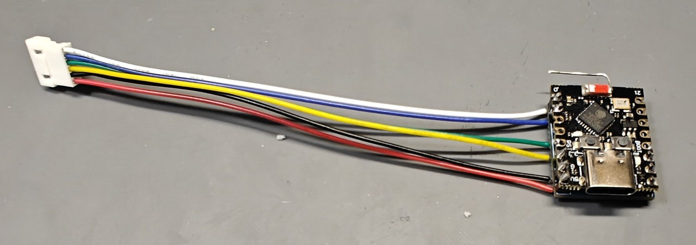

*Модификация антенны ESP32-C3 для стабильной связи*

> **Важно:** модифицируйте антенну только при подтверждённой проблеме со связью. Пайку выполняйте на полностью обесточенной ESP32-C3.

<a id="wifi"></a>

---

## 4. Подключение к Wi-Fi

После первой прошивки ESP32-C3 запускается в режиме собственной точки доступа. Подключите устройство к домашнему роутеру либо продолжайте использовать его напрямую в режиме точки доступа.

<a id="wifi-ap"></a>

### 4.1 Режим точки доступа

Заводские параметры:

- имя сети: `PS5_Smart_Cooler`;
- пароль: отсутствует;
- адрес веб-интерфейса: `http://192.168.4.1`.

Адрес `192.168.4.1` работает только тогда, когда телефон или компьютер подключён непосредственно к точке доступа ESP32-C3.

В режиме точки доступа можно изменить имя сети ESP32-C3 и задать пароль для подключения. После сохранения настроек устройство перезапустится, а подключаться к нему нужно будет уже по новым параметрам.

Кнопка **RESET WI-FI TO DEFAULT** возвращает ESP32-C3 в режим точки доступа с заводским именем `PS5_Smart_Cooler` и без пароля.

<a id="wifi-router"></a>

### 4.2 Подключение к домашнему роутеру

1. Подключитесь к сети `PS5_Smart_Cooler`.
2. Откройте `http://192.168.4.1`.
3. Откройте **NETWORK SETTINGS**.
4. Включите **Connect to home router**.
5. В поле **Access Point Name** укажите имя домашней Wi-Fi-сети.
6. Введите пароль домашней Wi-Fi-сети.
7. Нажмите **APPLY & REBOOT**.
8. После перезагрузки найдите ESP32-C3 в списке клиентов роутера или откройте её адрес `.local`.

Имя устройства по умолчанию формируется так:

```text
ps5-<первые четыре символа Device ID>.local
```

Например, для условного Device ID `012AB3456789` адрес будет `http://ps5-012A.local`.

В поле **Device Name (.local)** можно назначить другое уникальное имя длиной не более 15 символов.

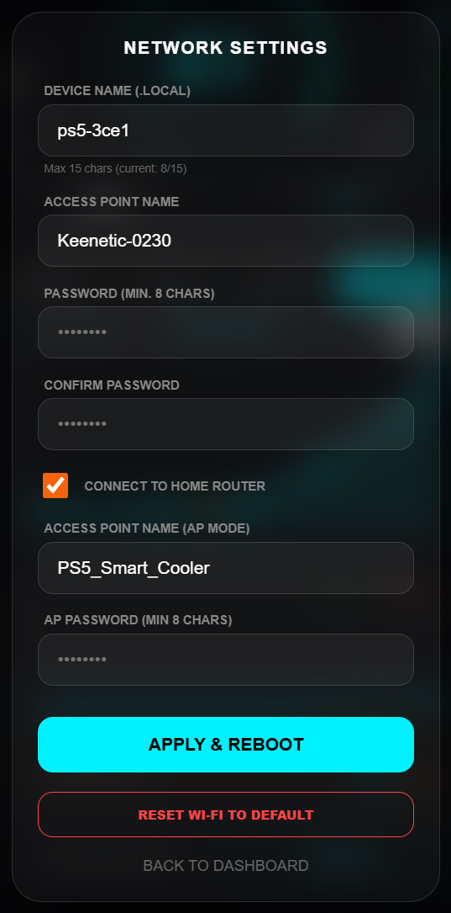

<a id="wifi-recovery"></a>

### 4.3 Восстановление связи с роутером

Если ESP32-C3 теряет домашнюю сеть:

1. Примерно через 30 секунд она создаёт собственную точку доступа.
2. Точка доступа работает 5 минут. За это время можно открыть `http://192.168.4.1` и изменить сетевые настройки.
3. Затем ESP32-C3 перезапускается и снова пытается подключиться к сохранённой сети.

Если устройство отображается в роутере, но имя `.local` не открывается, используйте выданный роутером IP-адрес. Поддержка `.local` зависит от mDNS в вашей локальной сети.

<a id="main-screen"></a>

---

## 5. Главный экран и основные функции


На главном экране расположены:

- **температура APU** - крупное значение в центре, °C;
- **INPUT (STOCK FAN SPEED)** - скорость, которую PS5 задаёт штатному вентилятору, %;
- **OUTPUT (BOOST FAN SPEED)** - скорость, которую Smart Cooler передаёт вентилятору, %;
- **MIN и MAX** - минимальная и максимальная температура за текущий период статистики;
- **график** - история температуры и скорости вентилятора за последние 30 минут;
- **кнопки режимов** - MANUAL, OFFSET, TARGET и GRAPH в полной версии;
- **AUTO-CLEAR STATS** и **RESET STATS** - управление статистикой;
- системные значки - Wi-Fi, тема, I2C, Advanced Settings, SC/PS5 и RGB в зависимости от версии.

В бесплатной версии INPUT и OUTPUT доступны только для просмотра. Управление скоростью вентилятора и кнопки MANUAL, OFFSET, TARGET и GRAPH доступны только в полной версии.

<a id="temperature-ring"></a>

### 5.1 Кольцо температуры

Вращающееся кольцо вокруг температуры позволяет быстро оценить нагрев и работу вентилятора:

- холодным температурам соответствует голубовато-бирюзовый цвет;
- по мере нагрева цвет плавно смещается к красному;
- скорость вращения зависит от OUTPUT;
- при остановленном вентиляторе кольцо останавливается и становится полупрозрачным;
- при отсутствии данных температуры кольцо бледнеет.

> **Примечание:** анимация кольца служит только для визуального контроля и не влияет на реальное управление охлаждением.

<a id="statistics"></a>

### 5.2 Статистика и график


График показывает последние 30 минут работы:

- синяя линия - температура;
- оранжевая линия - скорость вентилятора;
- шкала по вертикали используется для значений температуры и скорости от 0 до 100.

**AUTO-CLEAR STATS** автоматически очищает историю и значения MIN/MAX при выключении PS5 и при перезагрузке ESP32-C3. **RESET STATS** немедленно очищает статистику вручную.

<a id="system-controls"></a>

### 5.3 Системные элементы


Функции системных значков описаны в соответствующих разделах:

- [настройка Wi-Fi](#wifi);
- [переключение темы](#theme);
- [состояние I2C](#i2c-status);
- [Advanced Settings](#advanced-settings);
- [переключение SC/PS5](#sc-ps5);
- [RGB-подсветка](#rgb).

Набор значков зависит от версии прошивки и доступных функций. Ориентируйтесь на возможности, описанные в разделах ниже, а не на фиксированное количество значков.

<a id="theme"></a>

#### Переключение темы


Кнопка темы переключает светлое и тёмное оформление. Выбранная тема сохраняется в памяти ESP32-C3.

<a id="i2c-status"></a>

#### Состояние I2C


Значок I2C показывает состояние связи с PS5:

- **зелёный** - данные поступают;
- **красный** - связь отсутствует;
- **перечёркнутый** - пользователь включил игнорирование ошибки I2C.

> **Примечание:** игнорирование I2C используется только в режиме OFFSET и позволяет работать без показаний температуры, например при неполной установке. На главном экране отображается `--°C`. Эта функция не устраняет неисправность: если температура должна быть доступна, проверьте SDA, SCL и [раздел устранения проблем](#troubleshooting-i2c).

<a id="sc-ps5"></a>

#### Переключение SC/PS5


Кнопка **SC/PS5** доступна при установке дополнительной платы:

- **SC** - Smart Cooler управляет вентилятором в выбранном режиме;
- **PS5** - дополнительная плата физически передаёт вентилятору штатный PWM-сигнал консоли.

В режиме PS5 мониторинг и статистика продолжают работать. Переключение SC/PS5 не следует путать с выбором алгоритма MANUAL, OFFSET, TARGET или GRAPH.

<a id="interface-v2"></a>

### 5.4 Интерфейс V2


Классический веб-интерфейс является основным. V2 предоставляет те же функции с небольшими визуальными улучшениями.

Чтобы открыть V2, добавьте `/v2` к адресу устройства:

```text
http://192.168.1.100/v2
http://ps5-012A.local/v2
```

Отдельной кнопки переключения между интерфейсами нет. Оба интерфейса используют одни настройки.

<a id="fan-modes"></a>

---

## 6. Режимы управления вентилятором

MANUAL, OFFSET, TARGET и GRAPH доступны только в полной версии. Для рекомендуемой безопасной установки используйте дополнительную плату.

<a id="manual-mode"></a>

### 6.1 MANUAL - ручная скорость

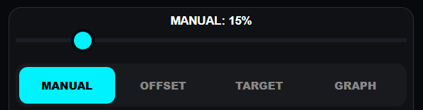

MANUAL удерживает выбранную пользователем скорость независимо от температуры и штатной команды PS5.

- диапазон: 0–100%;
- изменение выполняется ползунком;
- автоматическая коррекция по температуре отсутствует.

> **Внимание:** в режиме MANUAL нет автоматического ограничения минимальной скорости. Значение 0% полностью останавливает вентилятор.

<a id="offset-mode"></a>

### 6.2 OFFSET - прибавка к штатной скорости

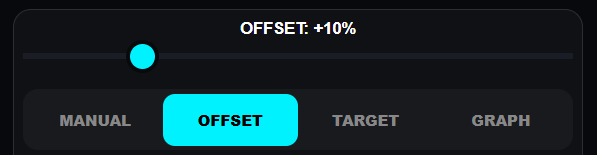

OFFSET берёт за основу INPUT и добавляет заданное значение:

```text
OUTPUT = INPUT + OFFSET
```

- диапазон OFFSET: 0–50%;
- итоговый OUTPUT ограничивается 100%;
- режим может работать без температуры, если включено [игнорирование ошибки I2C](#i2c-status).


<a id="target-mode"></a>

### 6.3 TARGET - поддержание температуры

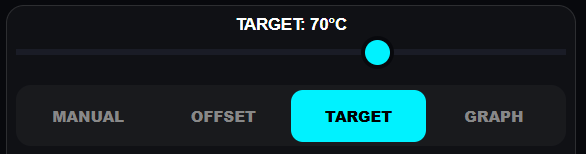

TARGET автоматически изменяет скорость вентилятора, чтобы удерживать заданную температуру.

- диапазон целевой температуры: 30–90 °C;
- **Sensitivity (K)** определяет интенсивность реакции на отклонение температуры;
- **Smooth** определяет плавность изменения скорости;
- режим требует работающего I2C и актуальных данных температуры.

Sensitivity настраивается в диапазоне 0,1–2,0. При увеличении значения контроллер быстрее реагирует на нагрев, но скорость может изменяться заметнее.

Smooth настраивается ползунком 1–50, что соответствует коэффициенту 0,001–0,050. Чем выше значение, тем медленнее и плавнее меняется скорость. Значение по умолчанию - 0,008.

Если данные I2C пропали, TARGET не может регулировать скорость по температуре. Восстановите связь или временно выберите MANUAL либо OFFSET.

<a id="graph-mode"></a>

### 6.4 GRAPH - управление по кривой


GRAPH задаёт зависимость скорости вентилятора от температуры с помощью опорных точек.

- температура: 0–100 °C;
- скорость: 0–100%;
- количество точек: от 2 до 10;
- при первом включении применяется пресет, показанный на скриншоте;
- режим требует работающего I2C.

Игнорирование ошибки I2C предназначено только для режима OFFSET. Оно позволяет работать без показаний температуры, но не восстанавливает мониторинг и не позволяет использовать TARGET или GRAPH.

<a id="graph-editor"></a>

#### Редактор кривой


- по горизонтали отображается температура;
- по вертикали - скорость вентилятора;
- синяя линия показывает настроенную кривую;
- оранжевая точка показывает текущее сочетание температуры и скорости.

Чтобы изменить кривую:

1. Перетащите синюю точку в нужное положение.
2. Для добавления точки нажмите **+**. Максимальное количество - 10.
3. Для удаления точки нажмите **−**. Минимальное количество - 2.
4. Завершите перемещение точки - новые координаты сохранятся автоматически.

Температура каждой следующей точки должна быть выше предыдущей. Скорость может увеличиваться или уменьшаться в пределах 0–100%.

<a id="monitoring"></a>

---

## 7. Расширенный мониторинг и диагностика

<a id="advanced-settings"></a>

### 7.1 Advanced Settings

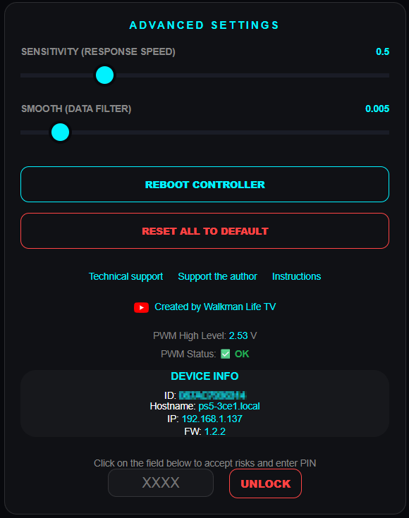

Панель **ADVANCED SETTINGS** содержит:

- параметры Sensitivity и Smooth для режима TARGET;
- версию прошивки;
- Device ID;
- перезагрузку ESP32-C3;
- возврат настроек к заводским значениям;
- диагностику PWM;
- доступ к Voltage Control и PMBus в полной версии.

Сброс и перезагрузка описаны в [отдельном разделе](#reset).

<a id="advanced-monitoring"></a>

### 7.2 Расширенный мониторинг


Расширенный мониторинг доступен в бесплатной и полной версиях. Он считывает данные по PMBus через шину I2C и отображает:

- **APU TEMP (EXACT)** - температура APU с дробной частью;
- **VIN** - входное напряжение;
- **APU_VGFX (6 phase)** - напряжение, ток и мощность графической части APU;
- **APU_VCORE (2 phase)** - напряжение, ток и мощность вычислительной части APU;
- **VRM TEMP APU_VGFX** и **VRM TEMP APU_VCORE** - температуры соответствующих VRM, то есть цепей стабилизации питания.

Данные обновляются раз в секунду, если PS5 включена и с момента её запуска прошло не менее 5 секунд. Температура VRAM через используемые интерфейсы недоступна.

<a id="pwm-diagnostics"></a>

### 7.3 Диагностика уровня PWM

Диагностика уровня PWM доступна только в полной версии.

> **Примечание:** для диагностики соедините PWM OUT дополнительной платы с GPIO2 ESP32-C3. Для обычного управления вентилятором это соединение не требуется.

ESP32-C3 раз в секунду измеряет напряжение высокого уровня PWM. Результат отображается в **ADVANCED SETTINGS**:

- **OK** - напряжение выше 2,5 В;
- **LOW** - напряжение ниже 2,5 В.

Ориентировочная интерпретация:

- **2,8–3,3 В** - нормальный уровень;
- **2,0–2,5 В** - проверьте питание и пайку;
- **ниже 2,0 В** - возможны обрыв, замыкание или неисправность выходной цепи.

При статусе LOW:

1. Проверьте, что на входе 5V ESP32-C3 присутствует стабильное питание не ниже 4,8 В.
2. Проверьте общую землю.
3. Проверьте GPIO6, GPIO7 и соединение с дополнительной платой.
4. Осмотрите пайку мультиплексора и резисторов.
5. Если конкретному вентилятору недостаточно уровня сигнала, замкните перемычку **SJ1**, шунтирующую резистор **1 кОм** в цепи **PWM IN**.

> **Внимание:** замыкайте SJ1 только на полностью обесточенной консоли.

<a id="voltage-control"></a>

---

## 8. Настройка напряжений

Voltage Control и PMBus Direct Access доступны только в полной версии.

> **Внимание:** неправильные значения могут вызвать нестабильность, невозможность запуска или повреждение PS5. Перед изменениями запишите заводские значения. Не отклоняйте напряжение от заводского значения более чем на 5–10% без полного понимания последствий.

Андервольт может снизить температуру и энергопотребление, но не гарантирует исправление `CE-108255-1` и других аппаратных неисправностей.

<a id="voltage-access"></a>

### 8.1 Доступ к Voltage Control

1. Откройте **ADVANCED SETTINGS**.
2. Найдите Device ID.
3. Возьмите последние четыре цифры Device ID - это PIN.
4. Примите предупреждение о рисках.
5. Введите PIN и нажмите **Unlock**.

Пример:

```text
Device ID: 012AB3456789
PIN: 6789
```

PIN отдельно не выдаётся. При первой установке актуальная версия прошивки также выводит его в монитор порта.

<a id="voltage-registers"></a>

### 8.2 Регистры напряжения

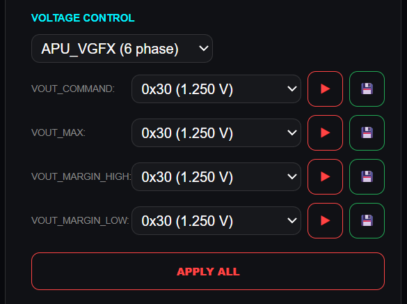

В панели доступны две страницы:

- **APU_VGFX (6 phase)** - напряжение графической части APU;
- **APU_VCORE (2 phase)** - напряжение вычислительной части APU.

На каждой странице используются четыре регистра:

| Регистр | Адрес | Назначение |
|---|---:|---|
| `VOUT_COMMAND` | `0x21` | Основное выходное напряжение |
| `VOUT_MAX` | `0x24` | Максимально разрешённое напряжение |
| `VOUT_MARGIN_HIGH` | `0x25` | Напряжение режима высокого запаса |
| `VOUT_MARGIN_LOW` | `0x26` | Напряжение режима низкого запаса |

Значения отображаются как код VID и соответствующее напряжение, например `0x8C (1.150 V)`.

Для каждого регистра доступны:

- кнопка **▶** - немедленно применить выбранное значение;
- кнопка **💾** - сохранить значение без немедленного применения.

<a id="voltage-tuning"></a>

### 8.3 Подбор значений

Безопаснее подбирать напряжение последовательно:

1. Выберите соседнее значение VID.
2. Примените его без сохранения.
3. Проверьте стабильность PS5.
4. Если система стабильна, при необходимости перейдите к следующему значению.
5. Сохраните только проверенные настройки.
6. Включите Auto-load только после завершения тестов.

Изменения, применённые кнопкой ▶ или **Apply All**, действуют до перезапуска консоли или отключения питания. Сохранение в памяти само по себе не означает немедленное применение.

> **Примечание:** для многих консолей отправной точкой могут служить **VCORE 1,050 В** и **VGFX 0,950 В**, но эти значения не гарантируют стабильность конкретной PS5.

<a id="voltage-testing"></a>

### 8.4 Проверка стабильности

Для повторяемой нагрузки можно использовать бесплатную игру **Astro’s Playroom**:

1. Дойдите до сцены с аквариумом в полу, расположенной в начале игры.
2. Установите ракурс камеры по эталонному изображению.
3. Оставьте консоль в этой сцене на 5–10 минут.
4. Следите за температурой и стабильностью работы.
5. После этого дополнительно проверьте консоль в обычных играх.

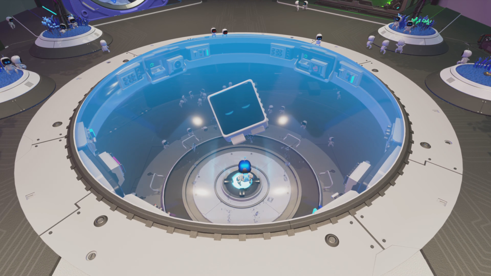

*Тестовая сцена Astro’s Playroom и рекомендуемый ракурс камеры*

Короткий тест не гарантирует стабильность во всех играх. Если появляются зависания, графические ошибки, перезапуски или `CE-108255-1`, вернитесь к предыдущему проверенному значению.

<a id="slim-voltage"></a>

### 8.5 Особенность PS5 Slim

На PS5 Slim сначала задайте значение `VOUT_MAX`, равное требуемому напряжению или превышающее его. Затем применяйте `VOUT_COMMAND` и остальные регистры. Если `VOUT_MAX` ниже выбранного значения, контроллер питания может проигнорировать запись.

Кнопка **Apply All** использует правильный порядок:

1. `VOUT_MAX`;
2. `VOUT_COMMAND`;
3. `VOUT_MARGIN_HIGH`;
4. `VOUT_MARGIN_LOW`.

Это особенность применения регистров на Slim, а не ограничение поддержки этой модели.

<a id="voltage-autoload"></a>

### 8.6 Массовое сохранение и Auto-load

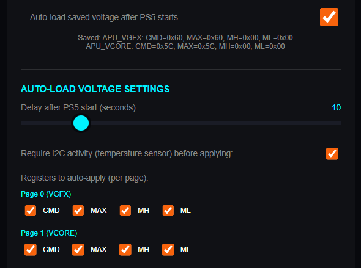

- **Apply All** - применяет все четыре регистра текущей страницы.
- **Save all registers for this page** - сохраняет значения всех регистров текущей страницы.
- **Auto-load saved voltage after PS5 starts** - автоматически применяет сохранённые значения после запуска PS5.
- **Delay after PS5 start** - задаёт задержку применения от 0 до 60 секунд.
- **Require I2C activity before applying** - разрешает применение только после появления активности I2C.
- **Registers to auto-apply** - выбирает регистры, которые будут применяться автоматически.

Auto-load можно включить или отключить в любой момент. При следующем запуске используются текущие настройки Auto-load и заданная пользователем задержка.

<a id="voltage-recovery"></a>

### 8.7 Восстановление после неудачных настроек

Если после включения Auto-load PS5 не запускается или работает нестабильно:

1. Откройте веб-интерфейс ESP32-C3. Он остаётся доступным независимо от состояния операционной системы PS5, пока ESP32-C3 получает питание.
2. Отключите **Auto-load saved voltage after PS5 starts**.
3. Перезапустите PS5, если она включена, либо включите её снова.
4. Верните предыдущие проверенные или записанные заводские значения.
5. Не включайте Auto-load до повторной проверки стабильности.

<a id="pmbus-direct"></a>

### 8.8 PMBus Direct Access


PMBus Direct Access предназначен для специалистов, которым известны назначение регистров и особенности конкретного контроллера питания.

- **Page** - страница 0 или 1;
- **Register** - шестнадцатеричный адрес регистра;
- **Value** - шестнадцатеричное значение для записи;
- **Read** - чтение регистра;
- **Write** - запись регистра.

> **Внимание:** ошибочная запись в произвольный регистр PMBus может вывести консоль из строя. Не используйте этот интерфейс для обычного подбора андервольта.

В нижней части панели отображаются сохранённые значения VID обеих страниц.

<a id="rgb"></a>

---

## 9. RGB-подсветка

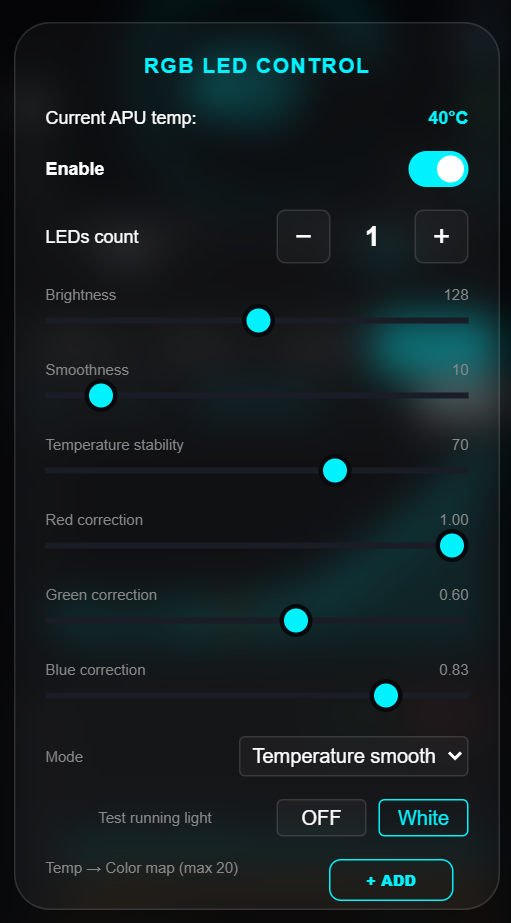

RGB-подсветка доступна в бесплатной и полной версиях. Используйте готовую адресную ленту или модуль на 5 В с контактами **VCC**, **GND** и **DIN**. Для готовых модулей дополнительные компоненты обычно не требуются.

<a id="rgb-connection"></a>

### 9.1 Подключение

- DIN подключите к GPIO21;
- VCC подключите к 5 В;
- GND подключите к общей земле ESP32-C3;
- при использовании отдельного источника 5 В обязательно объедините его GND с GND ESP32-C3.

Интерфейс поддерживает от 1 до 20 светодиодов. Небольшой модуль можно питать от общей линии 5 В.

> **Важно:** если потребление подсветки может превысить 500 мА, используйте отдельный источник 5 В и обязательно объедините его GND с GND ESP32-C3.

<a id="rgb-settings"></a>

### 9.2 Основные настройки

- **Enable** - включение и выключение подсветки;
- **LEDs count** - количество светодиодов от 1 до 20;
- **Brightness** - яркость от 0 до 255;
- **Smoothness** - плавность изменения цвета от 0 до 100;
- **Temperature stability** - сглаживание изменений температуры от 0 до 100;
- **Red/Green/Blue correction** - калибровка каждого канала в диапазоне 0,00–1,00;
- **White** - временное включение белого цвета;
- **Test running light** - последовательная проверка красного, зелёного и синего цветов.

<a id="rgb-modes"></a>

### 9.3 Режимы RGB

- **Ring** - плавный переход от холодного цвета к красному в зависимости от температуры;
- **Temperature** - резкое переключение цветов по заданной карте;
- **Temperature smooth** - плавный переход между точками цветовой карты;
- **Aura** - движущаяся радуга, не зависящая от температуры.

В Ring и Temperature smooth параметр Smoothness управляет скоростью перехода. В Aura он определяет скорость движения радуги.

<a id="rgb-map"></a>

### 9.4 Карта температуры и цвета

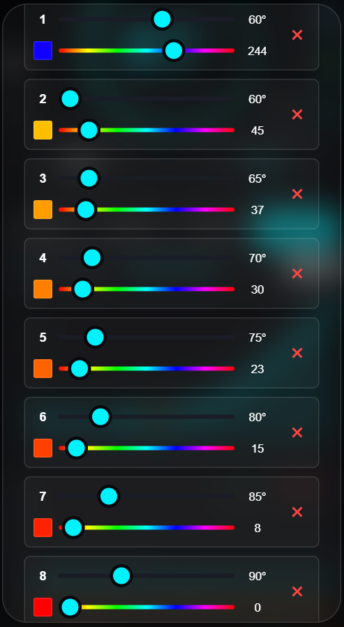

Карта содержит до 20 точек. Для каждой точки задаются температура и оттенок Hue.

- значение температуры следующей точки не может быть ниже значения предыдущей;
- **+ Add** добавляет новую точку;
- **×** удаляет точку;
- изменение Hue сразу включает предпросмотр выбранного цвета;
- после закрытия окна подсветка возвращается в выбранный рабочий режим.

Кнопка **Close** сохраняет настройки и карту в памяти ESP32-C3.

<a id="reset"></a>

---

## 10. Перезагрузка и сброс

Не путайте перезагрузку с возвратом к заводским настройкам:

| Действие | Что происходит с настройками |
|---|---|
| **REBOOT CONTROLLER** | ESP32-C3 перезагружается, настройки сохраняются |
| Отключение питания на 10 секунд | Устройство запускается заново, настройки сохраняются |
| **RESET ALL TO DEFAULT** | Пользовательские настройки удаляются |
| Повторная установка или обновление прошивки | Пользовательские настройки удаляются |

Если веб-интерфейс перестал отвечать, отключите питание устройства на 10 секунд. Для возврата к заводским значениям используйте **RESET ALL TO DEFAULT** в ADVANCED SETTINGS.

<a id="troubleshooting"></a>

---

## 11. Устранение проблем

Перед проверкой пайки, перемычек или разъёмов выключите PS5, отключите её от розетки и снимите питание с ESP32-C3. Не подключайте и не отключайте вентилятор на запитанной консоли. Если предложенные проверки не помогли устранить проблему, обратитесь в поддержку и приложите сведения, перечисленные в [конце инструкции](#support).

### 11.1 ESP32-C3 или COM-порт не определяется компьютером

**Возможные причины:** USB-кабель без передачи данных, неисправный USB-порт, отсутствующий драйвер или COM-порт, занятый другой программой.

1. Используйте заведомо исправный USB-кабель с передачей данных.
2. Попробуйте другой USB-порт.
3. Проверьте диспетчер устройств Windows.
4. Отключите другие устройства с виртуальными COM-портами.
5. Для первой установки подключите плату, удерживая BOOT.

Если COM-порт не появляется, при обращении в поддержку укажите версию Windows и название устройства из диспетчера устройств.

### 11.2 Установщик не находит плату

Убедитесь, что COM-порт появился, затем проверьте драйвер и USB-кабель. Закройте программы, которые могли занять этот порт, после чего полностью перезапустите установщик.

### 11.3 Установщик сообщает, что сервер недоступен

Проверьте подключение к интернету, настройки брандмауэра, VPN и прокси. Затем полностью перезапустите установщик. Состояние сервера и актуальные файлы проверяйте в группе поддержки.

### 11.4 Прошивка не записалась или процесс завершился ошибкой

Отключите ESP32-C3 от USB, проверьте кабель и стабильность питания, затем повторно запустите официальный установщик. Если ошибка повторяется на одном и том же этапе, не пытайтесь обходить защиту сторонними средствами: сохраните текст ошибки и обратитесь в поддержку.

### 11.5 Полная версия сообщает ID НЕТ В БАЗЕ

Device ID ещё не добавлен в список лицензий. Передайте показанный ID разработчику. После подтверждения полностью перезапустите установщик.

### 11.6 Активация не завершилась после первой прошивки

Новая плата может остаться в режиме BOOT:

1. отключите ESP32-C3 от USB;
2. подключите её повторно без удерживания BOOT;
3. снова запустите установщик.

### 11.7 После обновления пропали настройки

Это нормальное поведение. При каждом обновлении перезаписывается память настроек. Повторно задайте Wi-Fi, режим вентилятора, кривую, RGB и сохранённые напряжения.

### 11.8 Точка доступа не появилась

1. Убедитесь, что ESP32-C3 получает стабильное питание.
2. Подождите не менее 30 секунд.
3. Отключите питание устройства на 10 секунд, затем подключите его снова.
4. Проверьте, не подключилась ли ESP32-C3 к ранее сохранённому роутеру.
5. Поднесите телефон ближе к устройству и проверьте уровень сигнала Wi-Fi.

Если сеть появляется только в непосредственной близости, проверьте [размещение и антенну](#antenna).

### 11.9 Устройство не подключается к домашнему роутеру

1. Убедитесь, что роутер раздаёт сеть 2,4 ГГц: ESP32-C3 не подключается к сети, работающей только на 5 ГГц.
2. Повторно проверьте имя сети и пароль с учётом регистра символов.
3. Разместите ESP32-C3 ближе к роутеру для проверки качества сигнала.
4. Дождитесь резервной точки доступа, которая появляется примерно через 30 секунд после потери домашней сети.
5. Подключитесь к `PS5_Smart_Cooler`, откройте `http://192.168.4.1` и повторно сохраните параметры роутера.

### 11.10 Не открывается 192.168.4.1

Этот адрес доступен только в режиме точки доступа. Подключите телефон или компьютер к сети `PS5_Smart_Cooler`, отключите мобильную передачу данных при необходимости и повторно откройте `http://192.168.4.1`.

### 11.11 Устройство видно в роутере, но адрес local не работает

Откройте IP-адрес, указанный в списке клиентов роутера. Работа `.local` зависит от поддержки mDNS на клиентском устройстве и в локальной сети.

<a id="troubleshooting-i2c"></a>

### 11.12 Индикатор I2C красный или температура не обновляется

1. Убедитесь, что PS5 включена и после запуска прошло не менее 5 секунд.
2. Проверьте GPIO0/SCL и GPIO1/SDA.
3. Убедитесь, что SDA и SCL не перепутаны.
4. Проверьте пайку и общую землю.
5. Убедитесь, что логический уровень на линиях SDA и SCL составляет 3,3 В и на линиях установлены необходимые подтягивающие резисторы.

Если температура не нужна при неполной установке, можно включить [игнорирование I2C](#i2c-status). Это не устраняет неисправность соединения и не восстанавливает мониторинг.

### 11.13 ESP32-C3 не загружается после установки дополнительной платы

Полностью обесточьте устройство и проверьте отсутствие короткого замыкания между 5V, 3V и GND, а также ориентацию плат. Затем отсоедините ESP32-C3 от дополнительной платы и проверьте её запуск отдельно. Если плата работает отдельно, неисправность находится в монтаже или компонентах дополнительной платы.

### 11.14 Вентилятор не вращается

1. Полностью обесточьте консоль.
2. Проверьте направление подключения: PS5 → IN, OUT → вентилятор.
3. Проверьте GPIO6, GPIO7 и GPIO5.
4. Осмотрите дополнительную плату и пайку мультиплексора.
5. После включения проверьте выбранный режим и значение OUTPUT.
6. В режиме SC проверьте наличие PWM на GPIO6 осциллографом или мультиметром с измерением частоты, а также переключение BYPASS на GPIO5.
7. При недостаточном уровне сигнала используйте рекомендации из [диагностики PWM](#pwm-diagnostics).

> **Внимание:** не проверяйте вентилятор подключением и отключением разъёма на работающей консоли.

### 11.15 В режиме PS5 отображается INPUT, но вентилятор не работает

Вероятная причина находится в дополнительной плате, мультиплексоре или цепи PWM. Проверьте GPIO5, правильность IN/OUT и качество пайки. Если вентилятор работает напрямую, но не работает через дополнительную плату, проверьте уровень сигнала и перемычку **SJ1** на резисторе **1 кОм**.

### 11.16 PWM High Level показывает LOW

Проверьте питание 5 В, общую землю, GPIO6, GPIO7 и диагностическое соединение GPIO2. Подробный порядок приведён в разделе [Диагностика уровня PWM](#pwm-diagnostics).

### 11.17 PS5 Slim не принимает VOUT COMMAND

Сначала примените `VOUT_MAX`, равный или больший требуемого напряжения, затем `VOUT_COMMAND`. Удобнее использовать **Apply All**, который соблюдает правильный порядок. См. [особенность PS5 Slim](#slim-voltage).

### 11.18 После Auto-load PS5 не запускается

Веб-интерфейс ESP32-C3 продолжает работать, пока плата получает питание. Откройте его, отключите Auto-load и повторно запустите PS5. Полный порядок описан в разделе [Восстановление после неудачных настроек](#voltage-recovery).

### 11.19 RGB не работает или показывает неверные цвета

1. Убедитесь, что используется адресный модуль на 5 В.
2. Проверьте подключение VCC, GND и DIN.
3. Убедитесь, что DIN подключён к GPIO21.
4. Проверьте общий GND при отдельном питании.
5. Укажите правильное количество светодиодов.
6. Включите Enable и запустите Test running light.
7. При неверном оттенке настройте коррекцию каналов.

<a id="faq"></a>

---

## 12. Часто задаваемые вопросы

### Чем отличаются бесплатная и полная версии?

Бесплатная версия считывает доступные показатели и управляет RGB-подсветкой. Полная версия дополнительно управляет вентилятором, поддерживает SC/PS5, Voltage Control и PMBus Direct Access. Подробности отмечены в соответствующих разделах инструкции.

### Можно ли использовать ESP32-C3 без дополнительной платы?

Мониторинг, RGB и настройка напряжений работают без неё. Управление вентилятором технически также возможно, но не рекомендуется: режим PS5 и аварийный возврат отсутствуют, поэтому при отказе ESP32-C3 вентилятор может остановиться. См. [назначение дополнительной платы](#additional-board).

### Что произойдёт при отказе ESP32-C3?

При установленной дополнительной плате управление вентилятором автоматически возвращается PS5. Без дополнительной платы вентилятор может остановиться.

### Какие модели PS5 поддерживаются?

Поддерживаются все актуальные модели PS5: Fat, Slim и Pro. Расположение точек SDA/SCL различается и показано на фотографиях в разделе [Подключение к PS5](#ps5-connection).

### Почему после обновления сбросились настройки?

При каждом обновлении память настроек перезаписывается. Это предусмотренное поведение. См. [Обновление прошивки](#firmware-update).

### Как обновить прошивку?

Используйте установщик, соответствующий установленной версии: Monitoring или Full. Перед подключением USB выключите PS5, отключите её от розетки и для безопасности отсоедините ESP32-C3 от остальной схемы. См. [полный порядок обновления](#firmware-update).

### Можно ли обновлять прошивку по Wi-Fi?

Нет. OTA-обновление несовместимо с используемой схемой защиты. Обновление выполняется официальным установщиком через USB.

### Где посмотреть Device ID и PIN?

Device ID отображается в окне монитора порта и в Advanced Settings. PIN - последние четыре цифры Device ID. Актуальная прошивка также выводит Device PIN в монитор порта.

### Почему не открывается 192.168.4.1?

Адрес работает только при прямом подключении к точке доступа `PS5_Smart_Cooler`. В домашней сети используйте IP от роутера или адрес `.local`.

### Как узнать адрес устройства в домашней сети?

Найдите ESP32-C3 в списке клиентов роутера или откройте `ps5-<первые четыре символа Device ID>.local`.

### Почему PS5 Slim не применяет VOUT COMMAND?

На Slim сначала задайте `VOUT_MAX`, затем `VOUT_COMMAND`. Кнопка Apply All использует нужный порядок.

### Может ли андервольт исправить CE-108255-1?

Гарантии нет. На некоторых консолях сбои становятся реже, на других андервольт не помогает. Не рассматривайте его как замену диагностике неисправной PS5.

### Какая RGB-подсветка подходит?

Готовая адресная лента или модуль на 5 В с контактами VCC, GND и DIN. Линия DIN подключается к GPIO21. См. [RGB-подсветка](#rgb).

### Где открыть интерфейс V2?

Добавьте `/v2` к IP-адресу или имени `.local`. Отдельной кнопки переключения нет.

### Почему не отображается температура VRAM?

Температура VRAM недоступна через используемые шины и протоколы. Это не означает неисправность устройства.

### Можно ли вернуть ESP32-C3 к обычной прошивке?

Нет. После активации eFuse процесс необратим. Для последующих обновлений используется официальный установщик PS5 Smart Cooler.

<a id="support"></a>

---

## 13. Поддержка и полезные ссылки

- **Установщик полной версии:** [Скачать](ССЫЛКА_НА_УСТАНОВЩИК_FULL)
- **Установщик бесплатной версии:** [Скачать](ССЫЛКА_НА_УСТАНОВЩИК_MONITORING)
- **Чат поддержки PS5 Smart Cooler:** [Telegram](ССЫЛКА_НА_ГРУППУ_ПОДДЕРЖКИ)
- **Видео установки на PS5 Fat:** [YouTube](ССЫЛКА_НА_ВИДЕО_FAT)
- **Видео установки на PS5 Slim:** [YouTube](ССЫЛКА_НА_ВИДЕО_SLIM)
- **Видео по Voltage Control:** [YouTube](ССЫЛКА_НА_ВИДЕО_VOLTAGE_CONTROL)
- **Связь с разработчиком:** [Telegram](ССЫЛКА_НА_КОНТАКТ_РАЗРАБОТЧИКА)

При обращении укажите модель и ревизию PS5, версию прошивки, Device ID, описание симптома и выполненные проверки. Если проблема возникает до появления Device ID, укажите версию Windows и название устройства из диспетчера устройств.

